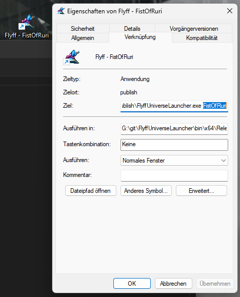

# About this Project

This project exists because i wanted a client where i could easily just launch all my characters while keeping good performance doing so.
Also i don't like building nodejs applications.

The published executable really is about 400 MB in size, but about 99.9% of it is the .NET Runtime and the bundled Chromium.
This launcher is written with minimal code and should be easy to follow.

## Fullscreen

Also i wanted a client _other than opera gx_ that allowed me to full-screen the game and not constantly break fullscreen by pressing _escape_.

This client allows you to toggle fullscreen by pressing `F11`

## Usage

Create a Desktop-Shortcut of `FlyffUniverseLauncher.exe` and adjust the Parameters to include some unique name (e.g. character name)

Each shortcut will have it's own cache and cookie store, so you can just open up all the instances by clicking their shortcut, without having to re-enter the credentials every time.

## Tech

This project uses the Chromium Embedded Framework, short CEF, to launch and host a chromium instance inside a .NET 6 Windows Presentation Foundation (WPF) application.

## Building from source

1. Install .NET 6 SDK
1. Clone this repo or download the source
1. Open a terminal in the project directory
1. Execute `dotnet publish -c Release --self-contained`
1. Observe the built files in `...\FlyffUniverseLauncher\bin\x64\Release\net6.0-windows\win-x64\publish`